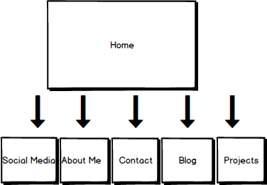

#Introduction to Design and Site Planning Reflection

    What are the 6 Phases of Web Design?

    The six steps of Web Design are information gathering, planning, design, deveopment, testing and delivery, and maintenance. Information gathering involves understanding the purpose of the company, your own goals and ambitions for the website, figuring out the target audience, and which content will be presented on the site. Planning involves creating a site map and discussing with the designer which technologies would be used or needed to build the website. The third phase, design, involves creating the look and feel of the site based on the target audience. This step also invovles creating logos and colors that will help the website stand out. The final step of this phase is a prototype created by the designer with a .jpg file which gives a good picture of how the site will look in its current form. Next comes the development phase. This is the phase in which a functional site will be produced, usually starting with the home page, and then implementing other pages through a "shell." The testing and delivery phase will involve the designer testing the site to make sure it is fully functional and fix any compatibility issues that may arise. Last is maintenance. This phase involves any additions or changes that need to made to the site as its userbase grows or if it needs to add any new features.

    What is your site's primary goal or purpose? What kind of content will your site feature?

    My website's primary goal and purpose is to allow visitors to view my blogs and projects, contact me if needed, connect to my social media platforms, and learn more about who I am as a person and my career goals and ambitions as well as my personal hobbies and interests. My site will feature any blog posts that I have made regarding my experience in DBC and web development, it will include my contact information such as my e-mail and phone number. It will also include any other projects that I have been a part of as well as information about me as a person and an aspiring developer. Last, it will include links to my social media profiles, such as my Linkedin, Twitter, Facebook, and Github.

    What is your target audience's interests and how do you see your site addressing them?

    My target audience's interests would be those that are interested in web development and the world of technology. My site would address this target audience by including insightful blog posts about my experience in web development as a student, as well as certain projects in web development that I have been a part of.

    What is the primary "action" the user should take when coming to your site? Do you want them to search for information, contact you, or see your portfolio? It's ok to have several actions at once, or different actions for different kinds of visitors.

    The primary "action" a user should take if this was a visitor that wanted to know information about me when coming to my site is clicking the About Me section because the primary purpose of the section is to learn about myself and my ambitions and goals. An extension of this action would be to click on blogs, to see what my recent activity has been and what are the topics that I find interesting. If the visitor was considering me for employment, then the primary action would be projects as he/she would be interested in knowing what I have worked on and my levels of expertise. This visitor would also want to click on Contact Me as well as my social media links to get in touch with me.

    What are the main things someone should know about design and user experience?

    The main things someone should know about design are it relies on two things. First and most importantly, understanding the target audience. Second, understanding the purpose of the site.  Without a solid understanding of who will use the website and why they will use it, the design process will ultimately fail because the design would be either too general or not specific enough to the target audience. The main thing someone should know about user experience is that it is the deciding factor on whether users will want to use your website or not. If the experience is not user-friendly or does not create a pleasant experience, the "perception" of the website, no matter how useful, will become negative and unpopular. This once again is related to a strong understanding of the purpose of the site and the target users, because a website geared for children will have a much different user experience than one that targets adults.

    What is user experience design and why is it valuable?

    User experience design involves creating designs that provide the user of a web site with a user experience that is easy to navigate, pleasant to use, and generally a site that "feels" good to use. Because user experience design involves controlling how users "feel" when they use a site, it involves other disciplines such as psychology. User experience design are also designs that are specific to a certain userbase based on the purpose and target audience of a site. By making the design specific to the userbase, these designs enhance the usability of the site and increase the chances of the site to gain permenant users. This is more useful in complex websites that could be hard to navigate and use if it does not have a user experience design that is well thought out and implemented.

    Which parts of the challenge did you find tedious?

    I had a difficult time understanding the difference between usability and user experience design as mentioned in the article by Jacob Gube. The reason I was having difficulty is because it seems that usability and user experience design seem so intertwined. A site's usability relates to its ability to navigate easily or be "user-friendly" but doesn't the look and feel of a site also effect how users judge whether a site is "usable" or not? I may have a difficult time understanding the key differences because I still do not know much about the specifics of the two and will look to read more articles on both.

