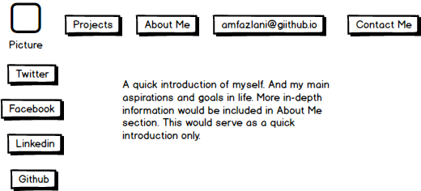
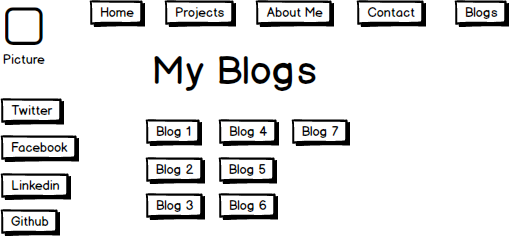

#My Wireframe Reflection

    What is a wireframe?
    A wireframe is a skeleton version of what your site will look like once it is fully functional. It allows your to plan out how your information will be ordered throughout the site. By wireframing each successive page in your website, you get a good picture of how someone will use your website and in which order. It will also give you a blueprint of the site similar to how houses require black and white blueprints before construction. This will give you an idea of what information your website will include as well as the functionalites that you need to implement on each page.

    What are the benefits of wireframing?

    The benefits of wireframing is that it gives you a visual repersentation of how your website will function and the content that will be included on each page. It also beneficial because it will give you a sense of how the users on your site will interact with the site, because of this designers use wireframes to ensure that the website has a good level of userability. Without having colors, fancy fonts, and other features that could possibly distract the designer from his/her user experience designing, wireframes offer a practical solution to designers to shut out the noise and see how the site will be used on a basic level.

    Did you enjoy wireframing your site?

    After understanding the benefits of wireframing, I found myself falling more in love with my wireframing tool. I enjoyed the aspect of mapping out and then visualizing the site through my wireframe, as well as adding buttons or features that I previously was not thinking about.

    Did you revise your wireframe or stick with your first idea?

    As I became more comfortable with my wireframing tool, I made certain changes that improved the site through both a visual aspect and navigationally such as adding a menu bar. I still am not fully comfortable with my wireframing tool, and as I become more comfortable, I believe it would be easier to build more effective wireframes.

    What questions did you ask during this challenge? What resources did you find to help you answer them?

    Certain questions that I asked during the challenge was if all developers and designers use wireframes or if there are different methods used by different designers. After looking at the chart provided in the reading, I saw that some developers and designers choose to skip wireframing all together and transition from sketching straight to coding. I believe that the most effective process, though, does include some level of wireframing because of its ability to highlight certain issues in navigation and functionality which will make the coding process easier.

    Which parts of the challenge did you enjoy and which parts did you find tedious?

    I enjoyed the process of learning about wireframes because it such an applicable tool that most, if not all professional designers and developers use on a daily basis to create websites and applications. Second, I enjoyed planning out my website and look forward to seeing my wireframe translate into a functional website. I did not find