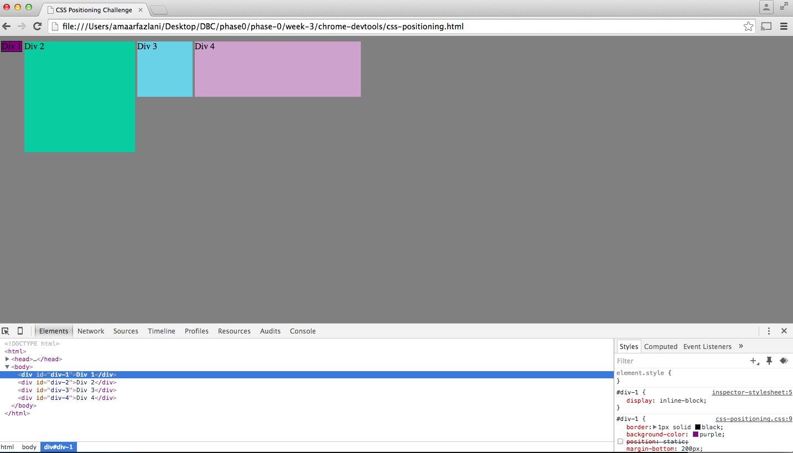
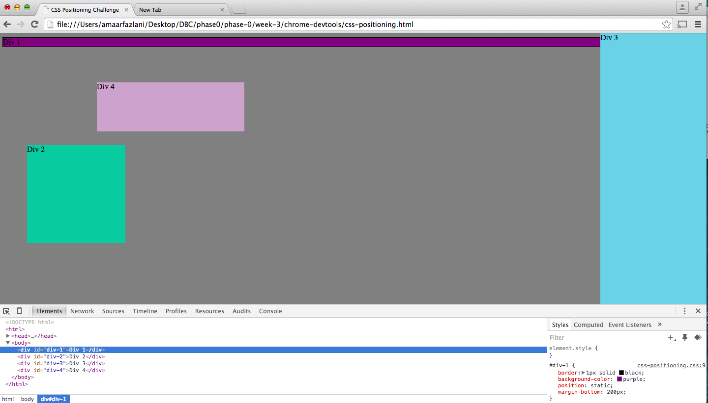

#Positioning Reflection

How can you use Chrome's DevTools inspector to help you format or position elements?
Chrome's DevTools inspector is very useful because it makes formatting and positioning elements more convenient by displaying the web page as the changes are being made. This allows the programmer to be more efficent as he/she no longer needs to go back and forth between the HTML document and the actual web page that is being displayed in the browser.

How can you resize elements on the DOM using CSS?

I am not too sure as I simply used font-size on CSS to resize my font. I used width/height properties to change the size of my element. To be honest, I am still getting used to using CSS and figuring out how DOM fits into the big picture. I will be sure to visit office hours this week to clairfy this question.

What are the differences between Absolute, Fixed, Static, and Relative positioning? Which did you find
easiest to use? Which was most difficult?

Absolute positioning is used when you want to place a certain element in the exact position on the web page that you wish. By adjusting the other properties such as top margin, bottom margin, etc. you can use absolute to place the element in the exact place that you need. Fixed positioning is used when want a certain element to not move even when you are scrolling through the page, this is most commonly used with sidebars, toolbars, etc. Static positioning is the default position and allows the element to move as it normally would when you move through a web page. Relative positioning is one that I still am having trouble with and cannot accurately describe at this point in time.

What are the differences between Margin, Border, and Padding?

From my understanding and what I have researched on the web, every element in CSS is seen as a box. The area between each box or element is the margin and this seperates the different elements. The padding is almost like an extension of the content of the element, for example if the element has any other attributes such as a picture, this will then be included in padding section. The border is the outermost layer of the element and affects the size of the element as shown on the web page.

What was your impression of this challenge overall? (love, hate, and why?)

This challenge was admittedly difficult because it was hard to gain a full understanding of what each property and attribute did to the element. Although, I was able to complete all the exercises, much of this challenge was done through trial and error and a lot of confusion. I hope to research more about CSS, DOM, and how to use the developer tools in the most effective way.

![Exercise #4][Exercise4.png)

