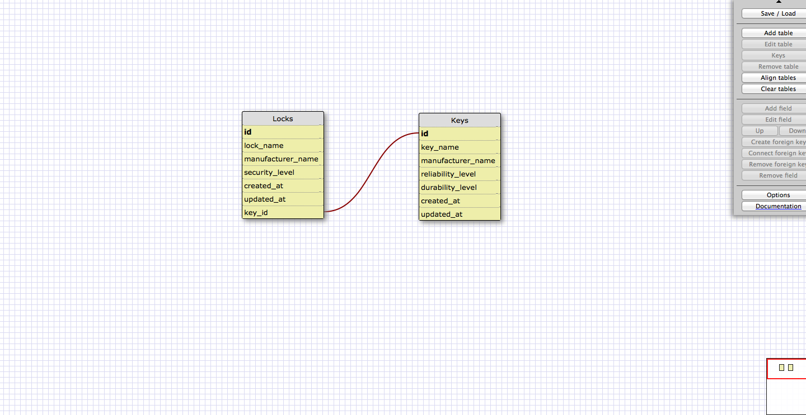

This is a one to one relationship because every lock only has one key and every key only has one corresponding lock just as the example used in the module which included countries and capitals. Therefore, this is a one to one relationship.

In the reflection section in your more-schemas.md file, answer the following questions:

What is a one-to-one database?
A one to one database is one in which the relationship is singular, meaning that there are not multiple relationships with the same values. For example, with countries and capitals, in the countries table there will only be one capital per country, just as in the capitals table there will be only one country name per capital.

When would you use a one-to-one database? (Think generally, not in terms of the example you created).
You would use one to on databases to emphasize singular relationships between two sets of data. For example, if a teacher was only teaching one course, and that course was only being taught by one teacher you would emphasize that with a one to one database.

What is a many-to-many database?
A many to many database is one in which there are multiple relationships being emphasized. For example, grocery lists and items. Items could be on more than one grocery list and grocery lists include more than one item, therefore each have relationships with many tables at once.

When would you use a many-to-many database? (Think generally, not in terms of the example you created).
You would use many to many databases when you are working with entities that are interelated but also have many other relations. For example, a family tree. A family tree can consist of a family that is realted to many other familes, but those families are also related to a different set of families.

What is confusing about database schemas? What makes sense?
I was very confused, at first, with running SQL on my computer. I was not aware that there was a different method in working with an SQL file than a regular md file that usually are using. Also, I was very confused in the many to many databases, because I am still trying to understand the basic defenitions of each of these concepts in SQL.